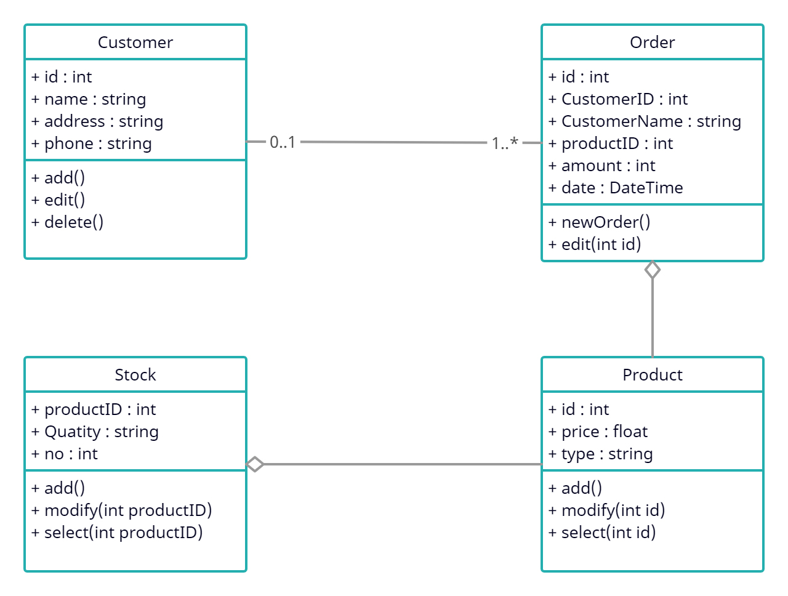
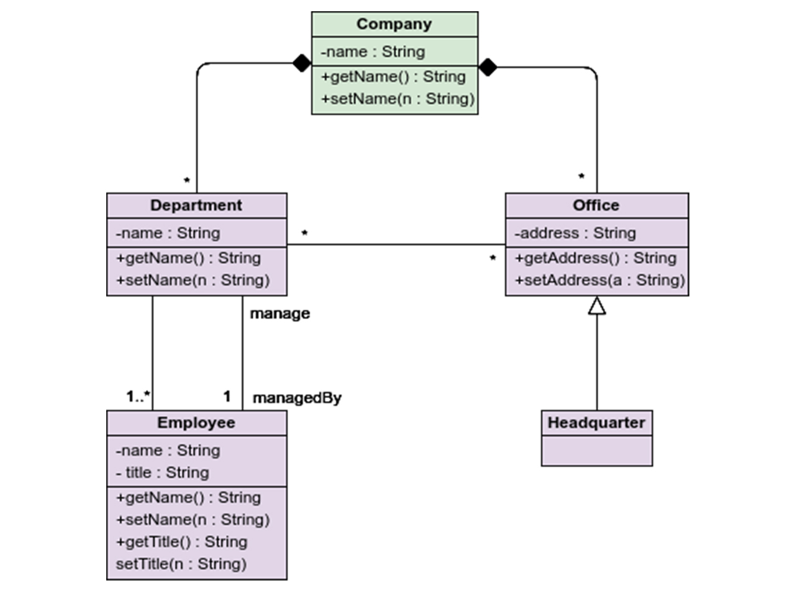
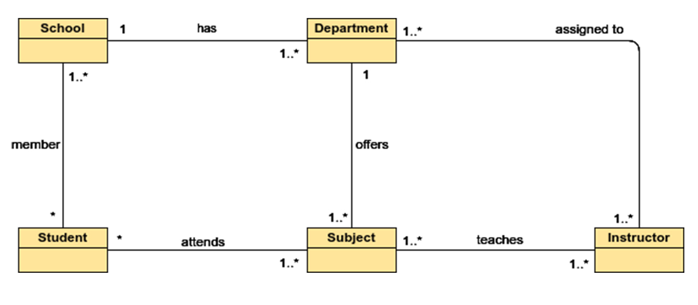

# Sınıf Diyagram Örnekleri
### Sipariş İşlemleri Sınıf Tasarımı
 

  <kbd></kbd>

 

- 0 veya 1 müşterinin (Customer) en az 1 veya daha fazla siparişi (Order) olabilir.
- Siparişin (Order) ürünü (Product) vardır.
- Stoğun (Stock) ürünü (Product) vardır.

### Banka Yönetim Sistemi Sınıf Tasarımı
 

  <kbd></kbd>

 

- Bankanın (Bank) ATM, Müşteri (Customer), Hesap (Account) sınıfları vardır.
- 1 müşterinin (Customer) en az 1 en çok 2 hesabı (Account) olabilir.
- 1 hesap (Account) 0 veya daha fazla ATM işlemi yapabilir.
- Hesap (Account) sınıfına ait iki tane alt sınıf vardır, Ana Hesap (Main Account) ve Birikim Hesabı (Saving Account).

### Şirket Yönetim Sistemi Sınıf Tasarımı
 

  <kbd></kbd>

 

- Şirketin (Company) 0 veya daha fazla departman (Department) ve ofisi (Office) vardır.
- Şirket (Company) olmadan departman (Department) ve ofis (Office) olamaz.
- Bir departmanın (Department) en az bir çalışanı (Employee) olmalıdır.
- Bir departman (Department) bir çalışan (Employee) tarafından yönetilir.
- Ofise (Office) ait bir merkez ofis (Headquarter) olabilir.

### Okul Yönetim Sistemi Sınıf Tasarımı
 

  <kbd></kbd>

 

- 1 okulun (School) en az bir veya daha fazla departmanı (Department) olabilir.
- En az 1 veya daha fazla okulun (School) birden fazla öğrencisi (Student) olabilir.
- 0 veya daha fazla öğrenci (Student) , en az 1 veya daha fazla ders (Subject) alabilir.
- En az 1 veya daha fazla dersin (Subject), en az 1 veya daha fazla öğretmeni (Instructor) olabilir.
- Bir departmanın (Department) en az 1 veya daha fazla dersi (Subject) olabilir.
- Bir veya daha fazla departmana (Department), 1 veya daha fazla öğretmen (Instructor) atanabilir.

### Sipariş Yönetim Sistemi Sınıf Tasarımı
 

  <kbd></kbd>

 

- Bir müşterinin 0 veya daha fazla siparişi olabilir.
- Bir siparişe ait sipariş detayı ve ürünleri olur.
- 1 siparişin birden fazla ödemesi olabilir.
- Nakit , Çek ve Kredi Kartı ödeme yöntemleridir.